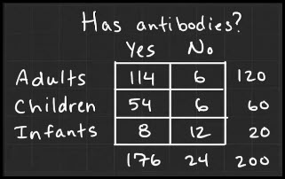

```{r setup, message=FALSE}
library(tidyverse)
library(DescTools)
library(ggmosaic)

library(VIM)

# Chunk options
knitr::opts_chunk$set(
  echo       = TRUE,    
  eval       = FALSE,  # FIXME: <---- Change this after solving the exercises
  fig.height = 3,       
  fig.width  = 5,       
  fig.align  = "center" 
)
```

Study material and answer the questions in a written form.
Then solve the exercises.

# Theory: Contingency Tables and Their Visualization

Contingency Tables:

-   [Contingency Table](https://www.statistics.com/glossary/contingency-table/){target="_blank"}
    -   What type of statistical data is summarized in contingency tables?
    Categorical
    -   How many variables are usually summarized in a contingency table?
    Usually two discrete random variables
-   [2.1 Contingency tables and scatterplots \| Basic Statistics \| Correlation and Regression \| UvA](https://youtu.be/Y0Q96Nauz_k){target="_blank"} 7:06
    -   What is "Contingency table" (or two way table, or cross-tabulation)? What does it show?
    A table that enables you to display a relationship between two ordinal or nominal variables.
    -   What variables can be summarized in a contingency table?
    Ordinal or nominal.
    -   What are "marginal percentages"?
    Counts in the margin of the table divided by the total number of
    observations that eventually equals to a percentage which is called a
    marginal percentage.
    -   What methods should be used instead of contingency tables if continuous data is used?
    Scatterplot
-   [2.7 Example contingency table | Basic Statistics | Correlation and Regression | UvA](https://youtu.be/9KIQC9Npndg){target="_blank"} 3:26
    - How can contingency table values can be created to relative percentages?
    By dividing values in cells by total column values and multiplying by 100 %.
    - Why are percentages important?
    To discern a correlation pattern, because using raw data can give you false results.
    
Plots for contingency tables:

-   [Marimekko Chart](https://datavizcatalogue.com/methods/marimekko_chart.html){target="_blank"}
    -   Is it true that "Marimekko plot" is also called "scatterplot"?
    False. It is also known as mosaic plot.
    -   Is it true that "Mosaic plot" is also called "Marimekko diagram"?
    Yes, exactly.
-   [Mosaic plots and segmented bar charts \| Exploring two-variable data \| AP Statistics \| Khan Academy](c){target="_blank"} 5:45
    -   How to interpret this plot?
    According to this video this mosaic plot represents percentages that were calculated from absolute values in the contingency table. Blue color represent percentage percentage of people that have antibodies in different age groups, while red part represent percentages of people that don't have antibodies. Width of different age groups also represents age group size compared to whole sample size.
    -   Does the plot show absolute counts or percentages?
    Percentages.
-   [Analyzing mosaic plots \| Exploring two-variable data \| AP Statistics \| Khan Academy](https://youtu.be/2sHkluggZp8){target="_blank"} 2:39
    -   Is the area of each rectangle in this plot proportional to the size of the group it represents?
    Yes, area/width of the rectangle proportionally represents the size of the group.
-   [Reading bar charts: comparing two sets of data \| Pre-Algebra \| Khan Academy](https://youtu.be/gnyHsgTFXIY){target="_blank"} 1:29
    -   Note: these bar charts are no a representation of a contingency table. They are just an example of chart type.
    -   How to understand and interpret grouped bar charts?
Grouped bar charts can represent two or more events of many s or other objects of the study. For instance, in this video there were compared midterm and final exam results, chart represented exam score on y axis and and student name on x axis. So there were represented two events - midterm and final exams. You can compare these events by looking to y axis, the difference of bar chart heights shows the difference of exam results.

## Example: Genders and Smoking

Most of *special* functions in this example comes from package `DescTools`.

Use this table from  ["Contingency Tables"](https://www.youtube.com/watch?v=W95BgQCp_rQ){target="_blank"} video (we did not watch it):

 

This is a 2×2 (2 rows, 2 columns) contingency table.

We assume that data is collected totally at random.


-   **How to import contingency tables into R?**

One way to do that is to import data via text variable.

Note, where goes word "Gender" (and were it is missing):

```{r}
crosstab_1a <- TextToTable("
        Smoker    Non-Smoker
Male       72           44
Female     34           53
")

crosstab_1a
```

More sophisticated example with variable names (a.k.a, "dimension names"):

```{r}
crosstab_1 <- TextToTable("
        Smoker    Non-Smoker
Male       72           44
Female     34           53
", dimnames = c("gender", "smoking_status"))

crosstab_1
```


-   **How to visualize cross-tab as a mosaic plot?**

Here is a quicker way to do it via `DescTools::Desc()`.
There will one more approach to do that via `ggplot2` at the end of this sub-section.

```{r paged.print=FALSE}
# plot(Desc(crosstab_1)) # or:
crosstab_1 |> Desc() |> plot()
```

-   **How to extend the results of a cross-tab with percentages?**

We will use `DescTools::Desc()` for that.
In the output:

-   `n:` number of cases included (203 in this example);
-   `freq` is absolute frequency: number of objects, etc. (e.g., there were 44 female non-smokers);
-   `perc` percentage of total (e.g., there were 26.1% female non-smokers);
-   `p.row` row percentage adds up to 100% (e.g. 37.9% of all males are non-smokers);
-   `p.col` column percentage adds up to 100% (e.g., 67.9% of all smokers are males, and 54.6% of all non-smokers are females);
-   `Sum` shows marginal frequencies and percentages, where appropriate.

> NOTE: pay attention to the chunk option `paged.print=FALSE`{.r}.
> Use it whith `DescTools::Desc()`{.r} when printing numeric results.

```{r paged.print=FALSE}
# Default is verbose = 2; And verbose = 1 gives only the basic results
crosstab_1 |> Desc(verbose = 1, plotit = FALSE)
```


-   **How to extend the results of a cross-tab with the results of various statistical analyses?**

We will learn about these analyses later in the course.
Now your task is to find were the results are placed.

In the results below, find the results of these statistical tests:

-   Pearson's χ² (chi-squared) test of independence
X-squared = 10.53
-   Fisher's exact test of independence *(for 2x2 contingency tables only)*
p-value = 0.001719
-   `Pearson's Chi-squared test (cont. adj)` shows the results χ² independence test (with Yates continuity correction).
X-squared = 9.6285
Please find these too:

-   `odds ratio` value with 95% confidence interval (CI) *(for 2x2 contingency tables only)*
odds ratio: 2.551
-   `Cramer V` coefficient
Cramer V: 0.2278
-   Goodman-Kruskal's `Lambda` (λ) coefficient (3 versions)
Lambda C|R: 0.1959; Lambda R|C: 0.1034; Lambda sym: 0.1522
```{r paged.print=FALSE}
# `verbose = 3` gives more results
crosstab_1 |> Desc(verbose = 3, plotit = FALSE)
```


-   **How to plot contingency table with `ggplot2`?**

There are 2 steps:

1)  Convert contingency table into initial data frame. Here `DescTools::Untable()`{.r} is handy.
2)  Use plotting (or other analysis) methods suitable for data frames.

```{r}
# Preview 5 random rows from the dataset
set.seed(10)
crosstab_1 |> Untable() |> slice_sample(n = 5)
```

We will show how to create:

a)  bar plots and
b)  mosaic plots.

```{r}
data_as_dataframe <- crosstab_1 |> Untable()

data_as_dataframe |> 
  ggplot(aes(x = gender, fill = smoking_status)) +
  geom_bar(position = "dodge") +
  scale_fill_brewer(palette = "Set1")
```

```{r}
library(ggmosaic)

data_as_dataframe |> 
  ggplot() +
  geom_mosaic(aes(x = product(gender), fill = smoking_status)) +
  scale_fill_brewer(palette = "Set1")
```

```{r}
data_as_dataframe <- crosstab_1 |> Untable()

data_as_dataframe |> 
  ggplot(aes(x = smoking_status, fill = gender)) +
  geom_bar(position = "dodge") +
  scale_fill_brewer(palette = "Set2")
```

```{r}
data_as_dataframe |> 
  ggplot() +
  geom_mosaic(aes(x = product(smoking_status), fill = gender)) +
  scale_fill_brewer(palette = "Set2")
```


## Exercise: Weight and Chocolate

Use this contingency table form the video lesson:

1)  Extend this cross-tab from one of video lessons with percentages and marginal data.
2)  Plot it as as bar chart (include only a single bar chart).


Do not include code, that is unnecessary to solve the two tasks described above.
I.e., not all the code from the example is needed.

> **IMPORTANT:** values that include spaces must be included in single quotes (if the string is in double quotes).

```{r}
# Values with spaces must be in single quotes
lentele <- TextToTable("
        <50      100-150  '< 150' 
'< 50'   27         5        1  
50-69    24        35        2  
70-89     6        43        19 
90+       3         7        28 
", dimnames = c("weight_kg", "chocolate_consumption_g"))
lentele
```
```{r}
lentele |> DescTools::Desc(verbose = 3, plotit = FALSE)
```

```{r}
extended_lentele <- TextToTable("
        <50      100-150  '< 150' Marginal_%    
'< 50'   27         5        1    16.5%
50-69    24        35        2    30.5%
70-89     6        43        19   34.0%
90+       3         7        28   19.0%
", dimnames = c("weight_kg", "chocolate_consumption_g"))
extended_lentele
```
```{r}
dataframe <- lentele |> Untable()
dataframe
```
```{r}
dataframe |> 
  ggplot(aes(x = chocolate_consumption_g, fill = weight_kg)) +
  geom_bar(position = "dodge") +
  scale_fill_brewer(palette = "Set1")
```


## Exercise: Antibodies and Age Groups

Here is a contingency table from one of the video lessons.
Import it into R, print and visualize as a mosaic plot (via `DescTools`).


```{r}
antibodies <- TextToTable("
         Yes       No        Total          
Adults    114       6         120  
Children  54        6         60  
Infants   8         12        20 
", dimnames = c("group", "has_antibodies"))
antibodies
```

```{r}
antibodies |> Desc() |> plot()
```


## Exercise: Beer

1) Import contingency table presented in [Contingency Table](https://www.statistics.com/glossary/contingency-table/) article into R. 
    - Total/Sum columns/rows should not be included in the final result. You may remove the unnecessary data by using matrix slicing methods on the result, e.g., `result[-5, -4]`.
    - If separator is tab and not space and there are errors in reading the table, then try using `sep = "\t"` in `TextToTable()`.
    
    ```{r}
beer <- TextToTable("
        Light   Regular   Dark          
Male    20      40        50  
Female  50      20        20  
", dimnames = c("sex", "beer_category"))
beer
```
    
2) Visualize data as a mosaic plot.

```{r}
beer |> Desc() |> plot()
```

# Theory: Logarithms and Log Change

 > Fold change is so called because it is common to describe an increase of multiple X as an "X-fold increase", [...] e.g., "2-fold" = "2 times" = "double"; [...] "3-fold larger" = "3 times larger".
>
> Source: [Fold change](https://en.wikipedia.org/wiki/Fold_change){target="_blank"}

-   [Logs (logarithms), Clearly Explained!!!](https://www.youtube.com/watch?v=VSi0Z04fWj0){target="_blank"} 15:36
    - How does logarithmic transformation change data?
Logarithmic transformation isolates exponents, puts positive and negative data's fold changes on a symmetric scale.
    - Why is it recommended to log transform fold changes in data before plotting?
Because then the plotted data will be symmetric, magnitude will be equidistant along the axis, on the other hand, if you don't do it, values can't be symmetric and it would be harder to interpret the plot.
    - Give an example in R of log-transformed fold changes in data (see below).
x <- 100/1; log(x)
    - Do all logarithms ($ln$, $lg$, $log_e$) work in the same way (e.g., for plotting purposes of data)?
Yes, it applies to all the logs.

```{r}
x <- c(100/1, 10/1, 0, 1/10, 1/100)
x
```

```{r}
# ln(x)
log(x)
```

```{r}
# ln(x + 1): sometimes good when data has 0 values
log1p(x)
```


```{r}
# lg(x)
log10(x)
```

We can logarithmically transform axes of plots axes if large values mask the differences in small values on the same plot (find an example in the next section).


# Theory: Create Contigency Tables from Description

Sometimes there is no table created and we should gather information from descriptions, tables, etc. of scientific articles, books or elsewhere.
It is important to notice that we usually should **not include** columns or rows with **totals** in a contingency table as we can calculate these later and they might interfere to perform some analyses.
If we have only information on total size an one of the group size, then we should calculate the size of the other group and not to include the sum. 
E.g., if there are 1000 male patients in the study (the total) and 20 of them have the contrition of interest, then the row of our table should be:

&nbsp;       | **Group A** | **Group B**
------------:|:-----------:|:-----------:
**males**    |     20      |     980
**females**  |     ...     |    ....

 And **not**:
 
&nbsp;       | **Group A** | ~~**Total**~~
------------:|:-----------:|:-----------:
**males**    |     20      |    1000
**females**  |     ...     |    ....


## Example: Vaccination against Lyme Disease

(Steere et al. 2008) investigated a vaccine against Lyme disease.
Our task is to create a contingency table based on the information in the article to visualize 2-year vaccine efficacy.
We should compare variables `treatment` (`Control` vs. `Vaccinated`) and `response` (`Healthy`, `Lyme`).
Response `Lyme` should include all definite Lyme disease cases.


```{r fig-ID-1667958497-437, echo=FALSE, fig.cap=caption, eval=TRUE, out.width=800}
caption <- "Table with results from (Steere et al., 1998)."
knitr::include_graphics("images/nejm199807233390401_t2.jpeg")
```


In the second year, after the third injection, 16 vaccine recipients and 66 placebo recipients had definite Lyme disease

**Source:**  
Steere, A. C. et al. Vaccination against Lyme disease with recombinant Borrelia burgdorferi outer-surface lipoprotein A with adjuvant. Lyme Disease Vaccine Study Group. 1998. *New England Journal of Medicine* 339: 209-215. DOI: https://doi.org/10.1056/nejm199807233390401


**Solution**

There were 5469 vaccinated and 5467 placebo (i.e., control) cases in total.
There were 16 vaccinated and 66 placebo cases that had Lyme disease.
So 5469 - 16 = 5453 vaccinated and 5467 - 66 = 5401 placebo cases had no definite Lyme symptoms.

```{r}
lyme_table <- TextToTable("
              Healthy Lyme
  Control       5401   66
  Vaccinated    5453   16
", dimnames = c("treatment", "response"))

lyme_table
```

```{r}
lyme_table |> Desc() |> plot()
```


```{r}
gg_lyme <- lyme_table |> 
  Untable() |> 
  ggplot(aes(x = treatment, fill = response)) +
  geom_bar(position = "dodge") +
  scale_fill_brewer(palette = "Dark2")

gg_lyme
```

Due to group size imbalance, we will plot counts in log scale.

```{r}
gg_lyme +
  coord_trans(y = "log1p") + # log1p is ln(x + 1)
  scale_y_continuous(
    breaks = c(0, 1, 2, 5, 10, 20, 50, 100, 200, 500, 1000, 2000, 5000, 8000)
  )
```


## Exercise: Divorce After Diagnosis

In (Glanz et al. 2009), it was investigated if level of abandonment after serious medical diagnosis depend on the sex of patient.
Basing on the following information from the article, construct an contingency table and perform the analysis.
Visualize the results.
The variables you investigate should be `ill_partner` (`man` vs. `woman`), and `marital_status` (`divorce` vs. `no divorce`).

> A total of 515 married patients were initially entered into this study with either a malignant primary brain tumor (N = 214), cancer (N = 193), or MS (N = 108).
> Two hundred fifty-four patients (53%) were female.

> No. of Divorces: female N = 53, male N = 7 (from Table 1)

**Source:**  
Glanz, M. C., et al. Gender disparity in the rate of partner abandonment in patients with serious medical illness.
2009. *Cancer* 115: 5237-42. DOI: <https://doi.org/10.1002/cncr.24577>

**Solution**

```{r}
divorce <- TextToTable("
         divorce   no_divorce
  man    7         254
  woman  53        201
", dimnames = c("ill_partner", "marital_status"))

divorce
```
```{r}
divorce |> Desc() |> plot()
```

```{r}
gg_divorce <- divorce |> 
  Untable() |> 
  ggplot(aes(x = marital_status, fill = ill_partner)) +
  geom_bar(position = "dodge") +
  scale_fill_brewer(palette = "Dark2")

gg_divorce
```

```{r}
gg_divorce +
  coord_trans(y = "log1p") + # log1p is ln(x + 1)
  scale_y_continuous(
    breaks = c(0, 1, 2, 5, 10, 20, 50, 100, 200, 500, 1000, 2000, 5000, 8000)
  )
```

# Theory: Create Contingency Table From Categorical Variables

If we want to perform statistical tests on contingency table, we should use `table()`, if we would like to plot the results with **`ggplot2`**, we should use `count()`.


## Example: Aids Survival (before July 1991)


Dataset `Aids2` contains data on patients diagnosed with AIDS in Australia before 1 July 1991.
Let's visualize a relationship between sex (`M`, male and `F`, female) and status (`A`, alive and `D`, dead) at the end of observation.

```{r}
data(Aids2, package = "MASS")
glimpse(Aids2)
```


Use `table()`{.r} for plotting and statistical tests:

```{r}
Aids2 |> with(table(sex, status))
```

```{r}
Aids2 |> with(table(sex, status)) |> Desc() |> plot()
```

The same table will be used for statistical tests.

```{r}
Aids2 |> with(table(sex, status)) |> chisq.test()
```

Use `count()`{.r} for `ggplot2` plots:

```{r}
Aids2 |> count(sex, status, .drop = FALSE)
```

```{r}
gg_a <-
  Aids2 |> 
  count(sex, status, .drop = FALSE) |>
  ggplot(aes(x = sex, y = n, fill = status)) +
  geom_col(position = "dodge") +
  scale_fill_brewer(palette = "Set1", direction = -1)

gg_a
```

```{r}
gg_a + coord_trans(y = "log1p")
```


# Theory: Test of Association/Independence of Nominal variables

- [p-values: What they are and how to interpret them](https://www.youtube.com/watch?v=vemZtEM63GY) 11:20:
    - What is a p value?
p value is a number between 0 and 1, that, in this example, quantify how
confident we should be that drug A is different from drug B.
    - Does p value give information on statistical significance?
Yes, p value usually has to be under 0,05 for difference to be statistically 
significant.
    - Does p value measure effect size?
No, it doesn't.
    - How to interpret p value? What does p values show?
p value shows statistical significance, in simple words it's a number
describing how likely it is that your data would have occurred by random chance.
- [P value versus effect size](https://www.youtube.com/watch?v=sTRPNxmBE2Y) 3:31
    - What, in simple words, is a p value? What does it show?
p value is probability that our finding is due to sampling error
    - What is an effect size?
A measure of how big the effect is.
    - Does correlation coefficient show effect size or statistical significance?
It shows effect size.
- Read *only* "Summary" parts of:
    1) [Chi-square test of independence](http://www.biostathandbook.com/chiind.html)
    2) [G–test of independence](http://www.biostathandbook.com/gtestind.html) and 
    3) [Fisher's exact test of independence](http://www.biostathandbook.com/fishers.html)
    - What are these tests for and when to use each of them?
    - Do these tests indicate statistical significance?
    - Do these tests indicate effect size?
- [Association Tests for Nominal Variables](http://rcompanion.org/handbook/H_04.html)
    - Read only theoretical part (before subsection "Packages used in this chapter")
    - Name the tests used to analyse association/independence of unpaired (non-repeated measures) nominal variables.
    - What data is appropriate for these tests?
    - What data is not appropriate for these tests?
    - How to choose between the tests?
    - How to interpret and report test results?
    - Take other important notes.


## Example: Indepenhdence Tests in R

**IMPORTANT NOTE!**  
You must use **only one** statistical test: the one which is the most suitable and relevant for particular dataset.

The result (association between nominal variables) is significant if $p < \alpha$, and usually in science significance level $\alpha = 0.05$.


Data used in the examples:

```{r}
gene_mutation <-  TextToTable("
        Yes    No
Mutate  56    274
OK      18    390")
```


### Fisher's Exact Test

Besides the p-value, for 2x2 tables, odds ratio and its 95% confidence interval are computed too.

```{r}
fisher.test(gene_mutation)
```


### G test of independence

G (log likelihood ratio) test of independence.


```{r}
DescTools::GTest(gene_mutation)
```


### Chi-square (χ²) test of independence

```{r}
chisq.test(gene_mutation)
```


### Several Tests with `Desc()`{.r}

In the result of

```{r paged.print=FALSE, eval=FALSE}
Desc(gene_mutation, verbose = 3, plotit = FALSE)
```


Find the section on statistical test results:

```
Pearson's Chi-squared test:
  X-squared = 31.891, df = 1, p-value = 0.00000001631
Pearson's Chi-squared test (cont. adj):
  X-squared = 30.514, df = 1, p-value = 0.00000003314
Fisher's exact test p-value = 0.00000002285
McNemar's chi-squared = 222.69, df = 1, p-value < 2.2e-16
```

Not all statistical tests are appropriate or relevant for your data.
You should use only one for your final decision.


# Theory: Effect Sizes for Association of Nominal variables

- [Measures of Association for Nominal Variables](http://rcompanion.org/handbook/H_10.html)
    - Read only theoretical part (before subsection "Packages used in this chapter")
    - Odds ratio, Cramer’s V, Goodman and Kruskal’s lambda (λ), Goodman and Kruskal’s tau (τ; the last one is not described in the source):
        - What are they?
Measures of association for nominal variables
        - What do they measure?
The strength of the association between two nominal variables
        - What are the ranges of possible values?
Odds ratio has zero to infinity range
Cramer's V has 0-1 range
Goodman and Kruskal's lambda has 0-1 range
Goodman and Kruskal's tau has 0-1 range
        - How should we interpret those values?
        
                                 Small     |  Medium       |  Large
Odds ratio                    1.55 – < 2.8 | 2.8 – < 5     |   ≥ 5
Cramer's V  *k=2             0.10 – < 0.30 |0.30 – < 0.50  | ≥ 0.50


Goodman and Kruskal's lambda; Goodman and Kruskal's tau -> both represent that
association is getting stronger when a measure is getting near 1, vice versa
it's getting weaker when it's coming near to zero.

        - What data is appropriate for these effect size measures?
- [7.4 - Cramer's V: Calculation and Interpretation](https://www.youtube.com/watch?v=BROyKPwsxKs)  0:57
    - While watching this video, look to information in it as to an alternative opinion. Especially about the suggested interpretation.
    - What is Cramer's V?
    - What is the suggested interpretation of numeric values of this coefficient?
- [What are the Goodman-Kruskal statistics?](https://support.minitab.com/en-us/minitab/21/help-and-how-to/statistics/tables/supporting-topics/other-statistics-and-tests/what-are-the-goodman-kruskal-statistics/)
    - What is Goodman-Kruskal tau (τ)? 
    - What does Goodman-Kruskal τ measure? 
    - What is Goodman-Kruskal lambda (λ)?
    - How are Goodman-Kruskal τ and λ related?
    - Are Goodman-Kruskal τ and λ measures of effect size?
    - Note: modal = relate to statistical mode.
-   [Odds and Log(Odds), Clearly Explained!!!](https://www.youtube.com/watch?v=ARfXDSkQf1Y){target="_blank"} 11:30
    -   What are odds?
    -   Why are log-odds used? Write R code that demonstrates the advantages of log-odds.
    ```{r}
    my_odds <- c(5/100, 2/10, 10/2, 100/5)
    list(odds = my_odds, log_odds = log10(my_odds))
    ```
-   [Odds Ratios and Log(Odds Ratios), Clearly Explained!!!](https://www.youtube.com/watch?v=8nm0G-1uJzA){target="_blank"} 16:19
    +   Note: read about the corrections in the comments of this YouTube video.
    -   What does the odds ratio show?
    -   Is odds ratio a measure of effect size?


## Examples: Effect Size for Association of Nominal Variables Calculation in R

Table `gene_mutation_2x2` will be used in the examples as a table with equal number of columns and rows (2 and 2). Some effect sizes can only be calculated for 2×2 TABLES.

```{r}
gene_mutation_2x2 <-  TextToTable("
        Yes    No
Mutate  56    274
OK      18    390")
```


### Odds Ratio and Log Odds Ratio

For 2×2 tables only.

```{r}
DescTools::OddsRatio(gene_mutation_2x2)
```

```{r}
DescTools::OddsRatio(gene_mutation_2x2) |> log10()
```

### Cramer's V

```{r}
# Bias-corrected  Cramer's V
DescTools::CramerV(gene_mutation_2x2, correct = TRUE)
```

```{r}
# Biased  Cramer's V
DescTools::CramerV(gene_mutation_2x2)
```

### Goodman-Kruskal's Tau


In this example we will use table `response_table` with different number of columns and rows, as the values are different only for this kind of data. Notice that if we know group (A, B, or C) we can predict the response with 100% accuracy. But if we know the response, it is sometimes ambiguous, which group created it.

```{r}
response_table <-  TextToTable("
         Yes    No
Group_A  50      0
Group_B  0      30
Group_C  0      20")
```

Here `direction` shows what is predicted: row (i.e., group A, B, or C in our example) or column (response Yes or No in our example):

```{r}
DescTools::GoodmanKruskalTau(response_table, direction = "row")
```

```{r}
DescTools::GoodmanKruskalTau(response_table, direction = "column")
```


### Goodman-Kruskal's Lambda

```{r}
DescTools::Lambda(response_table, direction = "symmetric")
```

```{r}
DescTools::Lambda(response_table, direction = "row")
```

```{r}
DescTools::Lambda(response_table, direction = "column")
```


### Several Effect Size Measures with `Desc()`{.r}

In the results of

```{r paged.print=FALSE, eval=FALSE}
Desc(gene_mutation_2x2, verbose = 3, plotit = FALSE)
```

Find the section on various effect sizes and their confidence intervals:

```
                       estimate  lwr.ci  upr.ci'
Contingency Coeff.       0.2035       -       -
Cramer V                 0.2079  0.1357  0.2800       <-----------
Kendall Tau-b            0.2079  0.1350  0.2808
Goodman Kruskal Gamma    0.6316  0.4653  0.7978
Stuart Tau-c             0.1242  0.0795  0.1688
Somers D C|R             0.1256  0.0804  0.1707
Somers D R|C             0.3441  0.1653  0.5229
Pearson Correlation      0.2079  0.1378  0.2759
Spearman Correlation     0.2079  0.1378  0.2759
Lambda C|R               0.0000  0.0000  0.0000       <-----------
Lambda R|C               0.1152  0.0671  0.1632       <-----------
Lambda sym               0.0941  0.0562  0.1319       <-----------
Uncertainty Coeff. C|R   0.0678  0.0246  0.1110
Uncertainty Coeff. R|C   0.0321  0.0108  0.0534
Uncertainty Coeff. sym   0.0436  0.0152  0.0720
Mutual Information       0.0319       -       -
```

Not all the coefficients of effect size are relevant for your data.


For 2x2 tables there also is a section on relative risk and odds ratio:

```
                    estimate lwr.ci upr.ci'
                                          
odds ratio             4.428  2.547  7.699            <-----------
rel. risk (col1)       3.846  2.308  6.411
rel. risk (col2)       0.869  0.824  0.916
rel. risk (row1)       1.834  1.566  2.147
rel. risk (row2)       0.414  0.276  0.622
```

# Theory: Report the Results

- [How to Report a Chi-Square Independence Test](https://quantifyinghealth.com/how-to-report-a-chi-square-independence-test/){target="_blank"}
- [LT] Additional resources in Lithuanian [Rezultatų aprašymas: ryšys tarp kategorinių kintamųjų](https://mokymai.github.io/biostatistika/ht-nominal-sasaja.html){target="_blank"}

# Theory: Additional Resources


Study these only if really needed.


Additional resources in Lithuanian:

- [LT] [Ryšys tarp kategorinių kintamųjų](https://mokymai.github.io/biostatistika/ht-nominal-sasaja.html)


# Data for Problem Sets

## Exercise: Independent vs. Dependent Variables

Analyse this code:

```{r}
library(tidyverse)
library(patchwork)
library(DescTools)

data(caith, package = "MASS")

# Convert data frame to two-way table
crosstab <- as.matrix(caith)
# Set dimension names
names(attributes(crosstab)$dimnames) <- c("Eyes", "Hair")
```

```{r}
# Effect size
c(
  "Cramer_V"     = CramerV(crosstab, correct = TRUE),
  "GK_tau_(R|C)" = GoodmanKruskalTau(crosstab),
  "GK_tau_(C|R)" = GoodmanKruskalTau(crosstab, direction = "column")
)
```

```{r}
# Statistical significance
# What is the size of p value?
GTest(crosstab)
```

```{r fig.width=6}
Desc(crosstab) |> plot()
```

```{r fig.width=8}
counts <-
  crosstab |> 
  Untable() |>
  count(Eyes, Hair, .drop = FALSE) 
  
counts |> 
  ggplot(aes(x = Eyes, y = n, fill = Hair)) +
  geom_col(position = "dodge") +
  scale_fill_brewer(palette = "Set2") + # <----- this + is from `patchwork`

counts |> 
  ggplot(aes(x = Hair, y = n, fill = Eyes)) +
  geom_col(position = "dodge") +
  scale_fill_brewer(palette = "Set1")
```

Tasks:

1) Use the same analyses (hypothesis test and effect size measures) as well as plots used above to explore these 3 examples of independent, dependent (but not 100%) and totally dependent categorical variables. Compare the results (p values, effect sizes, graphical representation) between these 3 cases.
2) Identify, which one of these 3 cases is the most similar to the hair/eye color example?

Most similar case to the hair/eye color example would be cat_dependent case.


```{r}
cat_independent <- TextToTable("
      A   B   C    D
Z_1  100  100 100  100
X_1  20   20  20   20
V_1  10   10  10   10
N_1  30   30  30   30
M_1  10   10  10   10
")
```
```{r}
c(
  "Cramer_V"     = CramerV(cat_independent, correct = TRUE),
  "GK_tau_(R|C)" = GoodmanKruskalTau(cat_independent),
  "GK_tau_(C|R)" = GoodmanKruskalTau(cat_independent, direction = "column")
)
```
```{r}
GTest(cat_independent)
```
```{r fig.width=6}
Desc(cat_independent) |> plot()
```


```{r}
cat_dependent <- TextToTable("
      A   B    C    D    E
Z_2 500  100 100  100  100
X_2  50  30   10   10   20
V_2  20  20   50   20   20
N_2  50  50   50   99   50
M_2  10  10   10   10   50
")
```
```{r}
c(
  "Cramer_V"     = CramerV(cat_dependent, correct = TRUE),
  "GK_tau_(R|C)" = GoodmanKruskalTau(cat_dependent),
  "GK_tau_(C|R)" = GoodmanKruskalTau(cat_dependent, direction = "column")
)
```
```{r}
GTest(cat_dependent)
```
```{r fig.width=6}
Desc(cat_dependent) |> plot()
```


```{r}
cat_totally_dependent <- TextToTable("
      A   B   C   D   E
X_3   0  10   0   0   0
V_3   0   0  20   0   0
M_3   0   0   0   0  60
Z_3 100   0   0   0   0
N_3   0   0   0  15   0
")
```
```{r}
c(
  "Cramer_V"     = CramerV(cat_totally_dependent, correct = TRUE),
  "GK_tau_(R|C)" = GoodmanKruskalTau(cat_totally_dependent),
  "GK_tau_(C|R)" = GoodmanKruskalTau(cat_totally_dependent, direction = "column")
)
```
```{r}
GTest(cat_totally_dependent)
```
```{r fig.width=6}
Desc(cat_totally_dependent) |> plot()
```


## Exercise: Aspirin vs. Cancer

In the investigation of (Cook et al. 2005) the effect of aspirin consumption on cancer risk was investigated:

> Objective: To examine the effect of aspirin on the risk of cancer among healthy women.

The simplified version of data can be downloaded from the website of "The Analysis of Biological Data", 3rd edition, by Michael Whitlock and Dolph Schluter.

```{r}
cancer_aspirin <-
  read_csv("https://whitlockschluter3e.zoology.ubc.ca/Data/chapter09/chap09e2AspirinCancer.csv")
class(cancer_aspirin)
```

Perform the the analysis that answers to this question, investigate, visualize and describe the results.

**Source:**  Cook, N. R., et al. Low-Dose Aspirin in the Primary Prevention of Cancer? The Women's Health Study: A Randomized Controlled Trial. 2005. *Journal of the American Medical Association* 294: 47-55. DOI: https://doi.org/10.1001/jama.294.1.47

Investigate the relationship between aspirin consumption and cancer status.
Visualize and report the results.

```{r}
cancer <- as.matrix(cancer_aspirin)
cancer1 <- data.frame(cancer)
glimpse(cancer1)
```

```{r}
cancer1 %>% count(aspirinTreatment, cancer)
```

```{r}
cancer1 %>% count(aspirinTreatment)
```
```{r fig.width=6}
ggplot(cancer1, aes(aspirinTreatment)) +
  geom_bar(aes(fill = cancer))
```
```{r}
status1 <- TextToTable("
            serga   neserga    viso
aspirinas    1438     18496   19934
placebas     1427     18515   19942
", dimnames = c("statusas", "bukle"))

status1
```
```{r}
naujas1 <- status1[,-3]
grafikas1 <- naujas1 %>% 
  Untable() %>% 
  ggplot(aes(x = statusas, fill = bukle)) +
  geom_bar(position = "dodge")
grafikas1
```
Aspirino vartojimas neturi didelės reikšmės vežio gydyme - aspirino ir placebo
vartojusių ir vėžiu susirgusių žmonių skaičius panašus.


## Exercise: Coffee and Cancer

(Wilson et al, 2011) claims that:

> Coffee contains many biologically active compounds, including caffeine and phenolic acids, that have potent antioxidant activity and can affect glucose metabolism and sex hormone levels.
> Because of these biological activities, coffee may be associated with a reduced risk of prostate cancer.

Your task is to investigate the association between coffee consumption status and prostate cancer status.
Perform the analysis, investigate, visualize and describe the results.

The simplified version of data will be downloaded from the website of "The Analysis of Biological Data", 3rd edition, by Michael Whitlock and Dolph Schluter.

```{r}
cancer_coffe <- 
  read_csv("https://whitlockschluter3e.zoology.ubc.ca/Data/chapter09/chap09q01CoffeeAndCancer.csv")

glimpse(cancer_coffe)
```

**Source:** Wilson, K. M., et al. Coffee Consumption and Prostate Cancer Risk and Progression in the Health Professionals Follow-up Study. 2011. *Journal of the National Cancer Institute* 103: 1-9. DOI: https://doi.org/10.1093/jnci/djr151


Investigate the relationship between coffee consumption and cancer status.
Visualize and report the results.

```{r}
coffee <- as.matrix(cancer_coffe)
coffee1 <- data.frame(coffee)
glimpse(coffee1)
```

```{r}
coffee1 %>% count(coffeeStatus, cancerStatus)
```

```{r}
coffee1 %>% count(coffeeStatus)
```
```{r fig.width=6}
ggplot(coffee1, aes(coffeeStatus)) +
  geom_bar(aes(fill = cancerStatus))
```
Kava pagerina tikimybę išvengti vežio.
```{r}
status <- TextToTable("
            serga   neserga    viso
kava            1        99     100
ne_kava         2        98     100
", dimnames = c("statusas", "bukle"))

status
```
```{r}
naujas <- status[,-3]
grafikas <- naujas %>% 
  Untable() %>% 
  ggplot(aes(x = statusas, fill = bukle)) +
  geom_bar(position = "dodge")
grafikas
```

