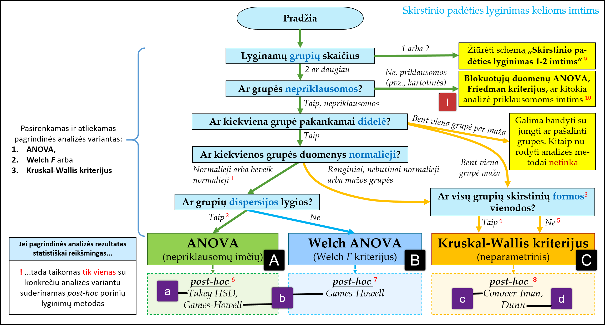

```{r setup, warning=FALSE, message=FALSE, results='hide'}
# Paketai --------------------------------------------------------------------
library(conflicted) 
library(tidyverse)

# Grafikams
library(ggpubr)

# Statistinei analizei
library(DescTools)
library(rstatix)
library(PMCMRplus)
library(effectsize)

# Nustatymai -----------------------------------------------------------------
knitr::opts_chunk$set(
  eval       = TRUE,
  fig.height = 3, 
  fig.width  = 7, 
  fig.align  = "center"
)

# Jei naudojate R ≥ 4.2.0, tai lokalės keisti nebūtina
# (t.y., su lokalės keitimu susijusias 5 eilutes galite ištrinti)
if (getRversion() < "4.2.0" && tolower(Sys.info()[['sysname']]) == "windows") {
  Sys.setlocale(locale = "Lithuanian")    # Windows ir R < 4.2.0
} else {
  Sys.setlocale(locale = "lt_LT.UTF-8")   # Linux, Mac arba R ≥ 4.2.0
}

ggplot2::theme_set(ggplot2::theme_bw())

# === Papildomos funkcijos ===================================================
# Jūsų projekte turi būti byla "funkcijos/sudaryk_cld.R"
source("funkcijos/sudaryk_cld.R", encoding = "UTF-8")
```

Šiame dokumente pateiktas šablonas atlikti analizę, kuri tinkama, kai turime kelias (įprastai daugiau negu dvi) **nepriklausomas** kiekybinių duomenų grupes ir norime palyginti jų skirstinių padėtį, sakykime, pagal vidurkius.
Pvz., kai 3 preparatai išbandomi su skirtingomis tiriamųjų grupėmis ir tiriamas atsako kintamasis yra kiekybinis (pvz., kraujospūdžio pokytis).
Netinka, jei matavimai yra kartotiniai (pvz., tas pats tiriamasis išbando visus 3 preparatus) ar turimi keli grupavimo kintamieji (pvz., į grupes skirstoma ir pagal vaistą, kurį gavo pacientas, ir pagal lytį): šioms situacijoms aptarti skirtas vienas poskyris, pažymėtas simboliais **[i]**.


# Metodo pasirinkimas

## Pasirinkimų schema kelioms nepriklausomoms imtis

Šiame dokumente nagrinėjama situacija, kai turimas 1 kiekybinis ir vienas grupavimo kintamasis, o grupės yra nepriklausomos (t.y., nekartotinės). 
Jums reikia pasirinkti tik vieną pagrindinės ir (jei reikia) vieną *post-hoc* (patikslinančios) analizės variantą.


> **Dėmesio:** schemoje pažymėti tik keli dažniausiai naudojami kriterijai šio tipo užduotims spręsti.

```{r pav-1, echo=FALSE, eval=TRUE, fig.cap=caption, out.width="100%"}
caption <- "**Pav. 1.** Skirstinio padėties lyginimo kelioms nepriklausomoms grupėms  metodų pasirinkimo schema, kuria rekomenduojama naudotis mokantis hipotezių tikrinimo. Raidės kvadratėliuose nurodo šio dokumento skyrius (juose taip pat bus šios raidės), kuriuose reiktų ieškoti metodą atliekančių funkcijų. 
Didžiosios ir mažosios raidės reiškia skirtingus dalykus.  "

# Path or URL to the figure.

```


## **[i]** Jei grupės priklausomos arba yra keli grupavimo kintamieji

Šis poskyris skirtas situacijoms, apie kurias šio kurso metu nesimokome.

Jei turite kelis faktorius, kartotinius arba mišraus tipo matavimus, siūlau peržiūrėti šiuos resursus (šiame dokumente plačiau nenagrinėjama):

1. Parametrinė analizė:
```{r, eval=FALSE}
?rstatix::anova_test
?rstatix::eta_squared
?effectsize::F_to_omega2
```

2. Neparametrinė analizė (priklausomos grupės):
```{r, eval=FALSE}
?rstatix::friedman_test
?rstatix::friedman_effsize
?PMCMRplus::frdAllPairsNemenyiTest
?PMCMRplus::frdAllPairsConoverTest

?friedman.test
```

3. Šaltinyje
<https://www.datanovia.com/en/courses/comparing-multiple-means-in-r/> pateikta išsami mokomoji medžiaga įvairesnėmis temomis. Rekomenduoju.


Atkreipkite dėmesį, kad kartotinių matavimų grupėms reikia tikrinti *papildomas prielaidas*, kurių šio kurso metu neaptarėme.

<!-- ====================================================================== -->

# Duomenys

Analizės funkcijoms reikiama duomenų struktūra: vienas kiekybinis kintamasis, kitas – kategorinis (grupavimo) kintamasis su bent 2 skirtingomis kategorijomis, duomenys pateikti **ilguoju** formatu.

Pavyzdžiuose:
 `duomenys` -- lentelės pavadinimas, 
 `y`        -- kiekybinio kintamojo pavadinimas,
 `grupe`    -- kategorinis (grupavimo) kintamasis.


```{r}
# TODO: Čia turėtų būti jūsų duomenų įkėlimo kodas

duomenys <-
  PlantGrowth %>%
  rename(y = weight, grupe = group) %>%
  # pasiverskim į kategorinį kintamąjį, kad veliau nekiltų problemų
  mutate(grupe = as_factor(grupe)) %>% 

  # Papildoma, jei reikia
  mutate(grupe = recode_factor(
    grupe,
    ctrl = "Kontrolė",
    trt1 = "Terpė I",
    trt2 = "Terpė II")
  )

# duomenys <- duomenys %>% mutate(grupe = fct_reorder(grupe, y, .fun = median))
```


******************************************************************************

> **Patarimas:** tam, kad nereiktų keisti viso šablono (kas užtrunka laiko ir
  gali atsirasti klaidų), rekomenduoju savo duomenų lentelę persivadinti į 
  `duomenys`, kategorinio kintamojo pavadinimą, pakeisti į `grupe`, 
  o kiekybinio – į `y` (kaip tai daroma pavyzdyje aukščiau).

******************************************************************************

```{r}
head(duomenys)
```

```{r}
glimpse(duomenys)
```

```{r}
duomenys %>% count(grupe)
```

<!-- ====================================================================== -->

# Suvestinės ir prielaidų tikrinimas 

<!-- ---------------------------------------------------------------------- -->

## Duomenų  suvestinės pagal klausimą


Pirmiausia atkreipkite dėmesį į aprašomosios statistikos rezultatus:

- duomenų centrus (skirtumus tarp grupių padėties),
- sklaidą (ir sklaidos skirtumus tarp grupių), 
- imties dydžius (absoliučiuosius grupių dydžius ir ar jie subalansuoti, ar grupės vienodo dydžio).

Aprašomoji statistika pogrupiams:

```{r, paged.print=FALSE}
Desc(y ~ grupe, data = duomenys, verbose = 3, plotit = FALSE)
```
Grafikai pogrupiams:

```{r fig.height=4, fig.width=8}
par(las = 2) # Pasuka užrašus bazinės „R“ sistemos (bet ne ggplot2) grafikuose
plot(Desc(y ~ grupe, data = duomenys))
```

```{r}
duomenys %>% 
  ggplot(aes(y = y, x = grupe, color = grupe)) +
  geom_boxplot() +
  geom_jitter(width = 0.1, color = "black", alpha = 0.5)
```

```{r}
duomenys %>% 
  ggplot(aes(x = y, color = grupe, fill = grupe)) +
  geom_density(alpha = 0.2, lwd = 1, adjust = 1) +
  geom_rug(alpha = 0.7)
```


<!-- ====================================================================== -->

<!-- ---------------------------------------------------------------------- -->

## Prielaidų tikrinimas (pagal kintamuosius)

> Šiame poskyryje demonstruojama analizė skirta **nepriklausomoms** imtims.

Prielaidas galime tikrinti pagal:

1) analizei parengtus duomenis (kintamuosius);
2) liekamąsias paklaidas naudodami modelio diagnostikos grafikus **(šiame dokumente nenagrinėjama)**.


**Išskirčių paieška.** 
Didelės išskirtys gali iškreipti parametrinės analizės rezultatus.
Tad vertinga patikrinti, ar kuriuos nors taškus galime laikyti išskirtimis.

```{r}
# Išskirčių paieška barjerų metodu.
duomenys %>% group_by(grupe) %>% identify_outliers(y)
```

↑ Jei tarp atsakymų nėra nei vienos eilutės, tai nėra taškų, kuriuos reiktų laikyti išskirtimis.

- `is.outlier` nurodo, ar tai sąlyginė išskirtis pagal barjerų metodą (reikšmė tarp vidinių ir išorinių barjerų).
- `is.extreme` nurodo, ar tai tikroji išskirtis (reikšmė už išorinių barjerų).
- Kiti stulpeliai gali padėti identifikuoti, kuris tiksliai šis taškas.

<br>

**Normalumo vertinimas**

Pagal kintamuosius nusibraižome QQ diagramas ir taikome normalumo kriterijus (testus) kiekvienai grupei atskirai.

```{r fig.height=3, fig.width=8}
duomenys %>% ggqqplot("y", facet.by = "grupe", scales = "free")
```

```{r}
duomenys %>% group_by(grupe) %>% shapiro_test(y)
```

Normalumo tikrinimas pagal pradinius kintamuosius: 

- bendrą išvadą priimkite ir pagal grafinio metodo, ir pagal statistinio kriterijaus rezultatus;
- jei kiekvienos grupės $p_i ≥ α$, tada įprastai prielaida tenkinama (aišku, būtina atsižvelgti į imties dydžius; čia $i$ yra grupės numeris);
- jei grupės didelės, tai Shapiro-Wilk (SW) $p$ galite lyginti su α=0,001 (o ne 0,05):
    + jei grupės didelės, SW rodo stat.reikšmingą nuokrypį, bet QQ rodo, kad jis nedidelis, tai dažnu atveju korektiška naudoti ir parametrinį metodą (esant didelėms imtims metodas yra atsparus nedideliems normalumo prielaidos pažeidimams);
- jei grupių dydžiai labai maži, tai SW kriterijui dažnu atveju nepakaks galios parodyti nuokrypį nuo normalumo, tad metodas (stat. hipotezių tikrinimas dėl normalumo) netinka per mažoms imtims;
- SW kriterijaus rezultatas gali būti netikslus, jei yra daug sutampančių reikšmių. Tokiu atveju gali reikti taikyti kitą kriterijų;
- normalumo prielaidą turi tenkinti kiekviena atskira grupė.


<br>

**Lygių dispersijų prielaidos tikrinimas.**

Pažiūrime, kokios yra grupių dispersijos ir SD:

```{r message=FALSE}
# Dispersijų ir SD skaičiavimas bei santykis tarp didžiausios ir mažiausios reikšmių
duomenys %>%
  group_by(grupe) %>% 
  summarise(dispersija = var(y), SD = sd(y)) %>% 
  ungroup() %>%
  mutate(
    max_min_dispersiju_santykis = round(max(dispersija) / min(dispersija), 1),
    max_min_SD_santykis         = round(max(SD)         / min(SD),         1)
  )
```

Preliminarus vertinimas: jei santykis tarp mažiausios ir didžiausios dispersijos skiriasi daugiau nei **3 kartus** (3x), tai įprastai laikoma, kad lygių dispersijų prielaida pažeista. Kai kurie autoriai siūlo šią 3x taisyklę taikyti standartiniams nuokrypiams.


Taikome statistinį Brown-Forsythe / Levene (centras - mediana) kriterijų:

```{r}
# DescTools::LeveneTest(y ~ grupe, data = duomenys)
rstatix::levene_test(y ~ grupe, data = duomenys)
```

Kai grupės pakankamai didelės, tai p ≥ α rodo, kad prielaida tenkinama (įprastai α=0.05).
Bet jei grupės per mažos, tai Levene kriterijui nepakanka galios rasti skirtumus tarp dispersijų (gali rodyti statistiškai nereikšmingą skirtumą net kai dispersijos pakankamai smarkiai skirtingos).

## Pasirenkame analizės metodą

Pagal aprašomosios statistikos ir prielaidų tikrinimo rezultatus išsirinkite **vieną** labiausiai tinkantį pagrindinės analizės metodą ir jį taikykite. To metodo rezultatai yra pateikti viename iš žemiau esančių skyrių.

<!-- ---------------------------------------------------------------------- -->

# Pagrindinė analizė

<!-- ---------------------------------------------------------------------- -->

## **[A]** ANOVA

Klasikinės dispersinės analizės variantas: vienfaktorė nepriklausomų imčių ANOVA.
Prielaidos ir reikalavimai:

- tiriamieji tarpusavyje nepriklausomi,
- kelios nepriklausomos (t.y., ne kartotinės) grupės,
- normaliai pasiskirsčiusios grupės (arba paklaidos),
- grupių dispersijos daugmaž vienodo dydžio.

Kai grupių dydžiai dideli ir **subalansuoti** (vienodi), ANOVA yra ganėtinai atspari nedideliems ir vidutinio dydžio normalumo bei lygių dispersijų prielaidų pažeidimams. Ir atvirkščiai, kuo grupių dydžiai mažesni bei kuo labiau skiriasi, tuo ANOVA jautresnė šių prielaidų pažeidimams.


```{r}
anova_rez <- duomenys %>% anova_test(y ~ grupe, detailed = TRUE)
anova_rez 
```

Tarp rezultatų:

- `p` – ANOVA *p* reikšmė;
- `ges` yra η² („generalized eta squared“, η²).


```{r}
get_test_label(anova_rez, type = "text", detailed = TRUE)
```

**Efekto dydis ω².**

Žinant tik ANOVA analizės kriterijaus statistikos $F$ ir laisvės laipsnių reikšmes, ω² galima įvertinti pagal formulę:

$$\omega^2 = \frac{(F - 1) \cdot df_n}{F \cdot df_n + df_d  + 1}$$
Kur $F$ -- kriterijaus statistika, $df_n = k - 1$ ir $df_d = N - k$ atitinkamai skaitiklio ir vardiklio laisvės laipsniai, $k$ -- lyginamų grupių skaičius, $N$ bendras imties dydis.

```{r}
omega2 <- 
  with(
    anova_rez, 
    effectsize::F_to_omega2(f = F, df = DFn, df_error = DFd, ci = .95)
  )

omega2
```
Preliminari efekto dydžio interpretacija (pagal tarp rezultatų nurodytą informacijos šaltinį ties `Rules:`).
```{r}
# Daugiau informacijos apie interpretaciją dokumentacijoje:
# ?effectsize::interpret_omega_squared
effectsize::interpret_omega_squared(omega2$Omega2_partial)
```


<!-- ---------------------------------------------------------------------- -->

## **[B]** Welch ANOVA (Welch *F* kriterijus) 

Prielaidos ir reikalavimai:

- tiriamieji tarpusavyje nepriklausomi,
- yra kelios nepriklausomos grupės,
- normaliai pasiskirsčiusios grupės (arba paklaidos).

Tinka:

- net jei netenkinama lygių dispersijų prielaida.


**Statistinio reikšmingumo tikrinimas.**

```{r}
w_anova_rez <- duomenys %>% welch_anova_test(y ~ grupe)
w_anova_rez
```

```{r}
get_test_label(w_anova_rez, type = "text", detailed = TRUE)
```


**Efekto dydis.**

Šiuo atveju efekto dydį galime įvertinti tik **labai apytiksliai** (greičiausiai, efekto dydžio reikšmė bus *padidinta*) pagal formulę:

$$\omega^2_{apytikslis} = \frac{(F - 1) \cdot df_n}{(F - 1) \cdot df_n + N}$$

Čia $F$ -- kriterijaus statistika, $N$ -- bendras imties dydis, $df_n = k - 1$ -- skaitiklio laisvės laipsniai, $k$ – lyginamų grupių skaičius. 

```{r}
omega2_wf <- 
  with(w_anova_rez, {
    F = statistic
    c(omega_kvadratu_apytikslis = unname((F - 1) * DFn / ((F - 1) * DFn + n)))
  })

omega2_wf
```


Preliminari efekto dydžio interpretacija (pagal tarp rezultatų nurodytą informacijos šaltinį ties `Rules:`).
```{r}
# Daugiau informacijos apie interpretaciją dokumentacijoje:
# ?effectsize::interpret_omega_squared
effectsize::interpret_omega_squared(omega2_wf)
```

<!-- ---------------------------------------------------------------------- -->

## **[C]** Kruskal-Wallis kriterijus

Prielaidos ir reikalavimai:

- tiriamieji tarpusavyje nepriklausomi,
- yra kelios nepriklausomos grupės.

Tinka, jei:

- netenkinama normalumo prielaida.

Kriterijus galingiausias, kai grupių duomenų *skirstiniai vienodos formos*: asimetrija vienodos krypties ir panašaus stiprumo, o sklaida – panašaus dydžio.

**Statistinis reikšmingumas.**

```{r}
kw_rez <- duomenys %>% kruskal_test(y ~ grupe)
kw_rez
```

```{r}
# X2 yra chi-kvadratu, dar kartais vadinama H statistika
get_test_label(kw_rez, type = "text", detailed = TRUE)
```


**Efekto dydis ($η^2_H$)**

Koeficientas $η^2_H$ yra neparametrinis η² (eta kvadratu) analogas, skaičiuojamas pagal Kruskal-Wallis kriterijaus rezultatus.

```{r}
duomenys %>% kruskal_effsize(y ~ grupe)
```

<!-- ====================================================================== -->

# *Post-hoc* (patikslinančioji) analizė 

Jei pagrindinės analizės rezultatai buvo statistiškai **reikšmingi**, tada tęsiame analizę atlikdami porinius lyginimus (patikslinančiąją *post-hoc* analizę).
**Kitu atveju** analizę baigiame ir padarome išvadą, kad statistiškai reikšmingų skirtumų nerasta.


<!-- ---------------------------------------------------------------------- -->
## **[a]** *Post-hoc:* Tukey HSD kriterijus 

**Tukey HSD** (Tukio pakankamai reikšmingo skirtumo) kriterijus yra tinkamas atlikti klasikinės **ANOVA** analizės *post-hoc* analizę (porinius palyginimus).

Tinka, kai:

- tenkinama normalumo prielaida;
- tenkinama lygių dispersijų prielaida;
- visų grupių dydžiai (daugmaž) vienodi;
- norima palyginti kiekvieną grupę su kiekviena.


**Reikšmingumo tikrinimas.**

Statistinį reikšmingumą vertinti pagal `p.adj` (koreguotoji *p*).

```{r}
# Lygina kiekvieną grupę su kiekviena.
# Pastaba: dabartinės „rstatix“ versijos (0.7.0) Tukio HSD analizės funkcija 
# ignoruoja parametro `conf.level` reikšmę, tad skaičiuojamas tik 95% PI.
tukey_test_rez <- 
  duomenys %>% 
  tukey_hsd(y ~ grupe, conf.level = 0.95, detailed = TRUE)

tukey_test_rez
```


```{r}
# Naudotų metodų apibūdinimas
get_pwc_label(tukey_test_rez, type = "text")
```

Naudotų metodų apibūdinime:

- **`pwc`**      -- (*pair-wise comparisons*) porinių lyginimų metodo pavadinimas;
- **`p.adjust`** -- *p* reikšmių korekcijos metodo pavadinimas.


Rezultatų lentelės stulpelių reikšmės:

- **`term`** -- kategorinio kintamojo pavadinimas;
- **`group1`**, **`group2`** -- lyginamos grupės;
- **`estimate`** -- skirtumas tarp grupių vidurkių;
- **`conf.low`** -- viršutinis skirtumo pasikliautinojo intervalo (PI) rėžis;
- **`conf.high`** -- apatinis skirtumo PI rėžis;
- **`p.adj`** -- porinio lyginimo koreguotoji $p$ reikšmė (pats kriterijus ir yra sukurtas taip, kad atliktų korekciją).


**CLD.**

```{r}
# Funkcija nukopijuota iš skyriaus „Papildomos funkcijos“
# Pastaba: rezultatas bus neteisingas, jei grupių pavadinimuose yra „-“ ženklas
cld_rez_tu <- sudaryk_cld(tukey_test_rez, alpha = 0.05)
cld_rez_tu
```


**Efekto dydis poroms.**

```{r}
# Koreguotasis Hedžo g* (su Hedžo pataisa)
efekto_dydis_poroms_g <- 
  duomenys %>% 
  rstatix::cohens_d(y ~ grupe, var.equal = TRUE, hedges.correction = TRUE) %>% 
  arrange(desc(abs(effsize))) # Išrikiuoja eilutes pagal efekto dydį

efekto_dydis_poroms_g
```


**Rezultatai grafiškai.**

```{r}
# Aukštis y ašyje, ties kuriuo pateikta CLD etiketė grafike.
# Galite įrašyti konkretų skaičių.
y_koordinate <- max(duomenys$y) + diff(range(duomenys$y)) * 0.1

duomenys %>% 
  ggboxplot(
    y     = "y",
    x     = "grupe",
    color = "grupe", 
    add   = "jitter",
    ylim  = c(NA, y_koordinate)) +
  rotate_x_text(angle = 30) +
  geom_text(aes(label = cld, x = group), y = y_koordinate, data = cld_rez_tu) 
```


**Papildoma: rezultatų sujungimas.**

```{r}
jungtinis_rez_t <-
  full_join(
    x = tukey_test_rez,
    y = efekto_dydis_poroms_g,
    by = c("group1", "group2")
  ) %>% 
  select(.y., term, everything())

jungtinis_rez_t
```


<!-- ---------------------------------------------------------------------- -->
## **[b]** *Post-hoc:* Games-Howell kriterijus

**Games-Howell** kriterijus yra tinkamas atlikti klasikinės **ANOVA** arba **Welch ANOVA** (Welch $F$) analizės *post-hoc* analizę (porinius palyginimus).

Tinka, kai:

- tenkinama normalumo sąlyga;
- norima palyginti kiekvieną grupę su kiekviena.

Bet:

- pažeidžiama lygių dispersijų prielaida,
- (ir/arba) grupių dydžiai skiriasi.


**Reikšmingumo tikrinimas.**

Statistinį reikšmingumą vertinti pagal `p.adj` (koreguotoji *p*).

```{r}
# Lygina kiekvieną grupę su kiekviena
gh_test_rez <- 
  duomenys %>%
  games_howell_test(y ~ grupe, conf.level = 0.95, detailed = TRUE)

gh_test_rez
```

```{r}
# Naudotų metodų apibūdinimas
get_pwc_label(gh_test_rez, type = "text")
```

Naudotų metodų apibūdinime:

- **`pwc`**      -- (*pair-wise comparisons*) porinių lyginimų metodo pavadinimas;
- **`p.adjust`** -- *p* reikšmių korekcijos metodo pavadinimas.


Rezultatų lentelės stulpelių reikšmės:

- **`.y.`** -- analizuojamas kintamasis;
- **`group1`**, **`group2`** -- lyginamos grupės;
- **`n1`**, **`n2`** -- lyginamos grupės;
- **`estimate`** -- skirtumas tarp grupių vidurkių;
- **`conf.low`** -- viršutinis skirtumo pasikliautinojo intervalo (PI) rėžis;
- **`conf.high`** -- apatinis skirtumo PI rėžis;
- **`p.adj`** -- porinio lyginimo $p$ reikšmė (koreguotoji; pats kriterijus ir yra sukurtas taip, kad atliktų korekciją);
- **`statistic`** -- kriterijaus statistika;
- **`df`** -- laisvės laipsniai.


**CLD.**

```{r}
# Funkcija nukopijuota iš skyriaus „Papildomos funkcijos“
# Pastaba: rezultatas bus neteisingas, jei grupių pavadinimuose yra „-“ ženklas
cld_rez_gh <- sudaryk_cld(gh_test_rez, alpha = 0.05)
cld_rez_gh
```


**Efekto dydis poroms.**

```{r}
# Koreguotasis Koheno d* (su Hedžo pataisa)
efekto_dydis_poroms_d <-
  duomenys %>% 
  rstatix::cohens_d(y ~ grupe, hedges.correction = TRUE) %>%
  arrange(desc(abs(effsize))) # Išrikiuoja eilutes pagal efekto dydį

efekto_dydis_poroms_d
```


**Rezultatai grafiškai.**


```{r}
# Aukštis y ašyje, ties kuriuo pateikta CLD etiketė grafike.
# Galite įrašyti konkretų skaičių.
y_koordinate <- max(duomenys$y) + diff(range(duomenys$y)) * 0.1

duomenys %>% 
  ggboxplot(
    y     = "y",
    x     = "grupe",
    color = "grupe", 
    add   = "jitter",
    ylim  = c(NA, y_koordinate)
  ) +
  rotate_x_text(angle = 30) +
  geom_text(aes(label = cld, x = group), y = y_koordinate, data = cld_rez_gh) 
```


**Papildoma: rezultatų sujungimas.**

```{r}
jungtinis_rez_gh <-
  full_join(
    x = gh_test_rez,
    y = efekto_dydis_poroms_d,
    by = c(".y.", "group1", "group2", "n1", "n2")
  )

jungtinis_rez_gh
```


**Papildoma: rezultatų sujungimas.**

```{r}
jungtinis_rez_gh <-
  full_join(
    x = gh_test_rez,
    y = efekto_dydis_poroms_d,
    by = c(".y.", "group1", "group2", "n1", "n2")
  )

jungtinis_rez_gh
```


<!-- ---------------------------------------------------------------------- -->
## **[c]** *Post-hoc:* Conover-Iman kriterijus

**Conover-Iman** kriterijus yra neparametrinis ir tinkamas atlikti **Kruskal-Wallis** kriterijus *post-hoc* analizę (porinius palyginimus). 
Galingesnis nei Dunn kriterijus, bet reikia pasirinkti ir naudoti tik vieną arba Conover-Iman, arba Dunn kriterijų.

Tinka, kai:

1. Kruskal-Wallis kriterijus rodo statistiškai reikšmingą skirtumą.


> **Svarbu:** korektiška naudoti tik tada, kai Kruskal-Wallis kriterijus rodo
> statistiškai reikšmingą skirtumą.

Statistinį reikšmingumą vertinti pagal `pval` (koreguotoji *p*).

```{r}
# Lyginimas: kiekviena grupė su kiekviena
# Paketas DescTools
conover_rez <- ConoverTest(y ~ grupe, data = duomenys, method = "holm")
conover_rez
```

```{r}
# Jei reikia, kad rezultatai būtų pateikti duomenų lentele
conover_rez_df <- 
  as.data.frame(conover_rez[[1]]) %>%
  rownames_to_column("groups") %>% 
  separate("groups", into = c("group1", "group2"), sep = "-")

conover_rez_df
```


**CLD.**

```{r}
# Funkcija užkrauta naudojant source()
# Pastaba: rezultatas bus neteisingas, jei grupių pavadinimuose yra „-“ ženklas
cld_rez_c <- sudaryk_cld(conover_rez, alpha = 0.05)
cld_rez_c
```


**Efekto dydis poroms.**

```{r}
# Neparametrinis r tipo efekto dydis, skaičiuotas pagal nepriklausomų imčių 
# Mann-Whitney-Wilcoxon kriterijaus rezultatus
efekto_dydis_poroms_rw <- 
  duomenys %>% 
  wilcox_effsize(y ~ grupe) %>%
  arrange(desc(abs(effsize))) # Išrikiuoja eilutes pagal efekto dydį

efekto_dydis_poroms_rw
```


**Rezultatai grafiškai.**


```{r}
# Aukštis y ašyje, ties kuriuo pateikta CLD etiketė grafike.
# Galite įrašyti konkretų skaičių:
y_koordinate <- max(duomenys$y) + diff(range(duomenys$y)) * 0.1

duomenys %>% 
  ggboxplot(
    y     = "y",
    x     = "grupe",
    color = "grupe", 
    add   = "jitter",
    ylim  = c(NA, y_koordinate)
  ) +
  rotate_x_text(angle = 30) +
  geom_text(aes(label = cld, x = group), y = y_koordinate, data = cld_rez_c) 
```


<!-- ---------------------------------------------------------------------- -->
## **[d]** *Post-hoc:* Dunn kriterijus

**Dunn** kriterijus yra neparametrinis ir tinkamas atlikti **Kruskal-Wallis** kriterijus *post-hoc* analizę (porinius palyginimus). 
Mažiau galingas nei Conover-Iman kriterijus (tačiau plačiau žinomas).


**Reikšmingumo tikrinimas.**

Statistinį reikšmingumą vertinti pagal `p.adj` (koreguotoji *p*).

```{r}
# Lygina kiekvieną grupę su kiekviena
dunn_test_rez <- duomenys %>% dunn_test(y ~ grupe, detailed = TRUE)
dunn_test_rez
```

```{r}
# Naudotų metodų apibūdinimas
get_pwc_label(dunn_test_rez, type = "text")
```

Naudotų metodų apibūdinime:

- **`pwc`**      -- (*pair-wise comparisons*) porinių lyginimų metodo pavadinimas;
- **`p.adjust`** -- *p* reikšmių korekcijos metodo pavadinimas.


**CLD.**

```{r}
# Funkcija nukopijuota iš skyriaus „Papildomos funkcijos“
# Pastaba: rezultatas bus neteisingas, jei grupių pavadinimuose yra „-“ ženklas
cld_rez_d <- sudaryk_cld(dunn_test_rez, alpha = 0.05)
cld_rez_d
```


**Efekto dydis poroms.**

```{r}
# Neparametrinis r tipo efekto dydis, skaičiuotas pagal nepriklausomų imčių 
# Mann-Whitney-Wilcoxon kriterijaus rezultatus
efekto_dydis_poroms_rw <- 
  duomenys %>% 
  wilcox_effsize(y ~ grupe) %>%
  arrange(desc(abs(effsize))) # Išrikiuoja eilutes pagal efekto dydį

efekto_dydis_poroms_rw
```


**Rezultatai grafiškai.**

```{r}
# Aukštis y ašyje, ties kuriuo pateikta CLD etiketė grafike.
# Galite įrašyti konkretų skaičių.
y_koordinate <- max(duomenys$y) + diff(range(duomenys$y)) * 0.1

duomenys %>% 
  ggboxplot(
    y     = "y",
    x     = "grupe",
    color = "grupe", 
    add   = "jitter",
    ylim  = c(NA, y_koordinate)
  ) +
  rotate_x_text(angle = 30) +
  geom_text(aes(label = cld, x = group), y = y_koordinate, data = cld_rez_d) 
```


<!-- ====================================================================== -->


